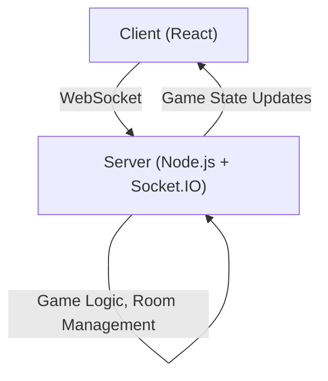

# Gongzhu Web App Project Plan

## 1. Requirements & Features

- **User Authentication**: Simple nickname or guest login.
- **Lobby System**: Players can join a game room; game starts when 4 players are present.
- **Game Logic**: Implement Gongzhu rules (card dealing, trick-taking, scoring, etc.).
- **Real-Time Gameplay**: Players see each other's moves in real time.
- **UI/UX**: Responsive, intuitive interface for desktop and mobile.
- **Persistence**: Handle disconnects/reconnects gracefully.
- **Chat (Optional)**: In-game chat for players.

---

## 2. Tech Stack

- **Frontend**: React (with TypeScript), Tailwind CSS (for styling)
- **Backend**: Node.js with Express
- **Real-Time Communication**: Socket.IO (WebSockets)
- **State Management**: React Context or Redux (for client), in-memory or Redis (for server)
- **Deployment**: Vercel/Netlify (frontend), Render/Heroku (backend) or similar

---

## 3. System Architecture

---

## 4. Implementation Steps

### A. Project Setup
- Initialize monorepo or separate folders for frontend and backend.
- Set up basic React app and Express server.

### B. Backend Development
1. **Socket.IO Integration**: Handle connections, disconnections, and messaging.
2. **Lobby/Room Management**: Create/join rooms, start game when 4 players join.
3. **Game State Management**: 
   - Card shuffling/dealing
   - Turn management
   - Trick resolution
   - Scoring
   - Game end detection
4. **APIs**: (if needed) for lobby listing, player stats, etc.

### C. Frontend Development
1. **Login/Lobby UI**: Enter nickname, join/create room, show player list.
2. **Game Table UI**:
   - Display cards in hand
   - Show played cards, current trick, scores
   - Indicate turn, valid moves
3. **Socket.IO Client**: Connect to server, handle real-time updates.
4. **Animations/UX**: Card movements, notifications, etc.

### D. Testing
- Unit tests for game logic.
- Integration tests for server-client communication.
- Manual playtesting.

### E. Deployment
- Deploy backend and frontend.
- Set up environment variables, CORS, etc.

---

## 5. Milestones

1. **MVP**: 4 players can join, play a full game, and see scores.
2. **Polish**: Improved UI, error handling, reconnection.
3. **Enhancements**: Chat, player profiles, persistent stats.

---

## 6. Next Steps

1. **Confirm ruleset**: Any house rules or standard Gongzhu?
2. **Set up project structure**: Initialize frontend and backend.
3. **Start with lobby and real-time connection.** 